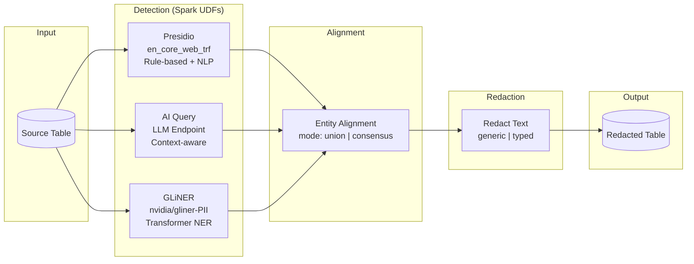
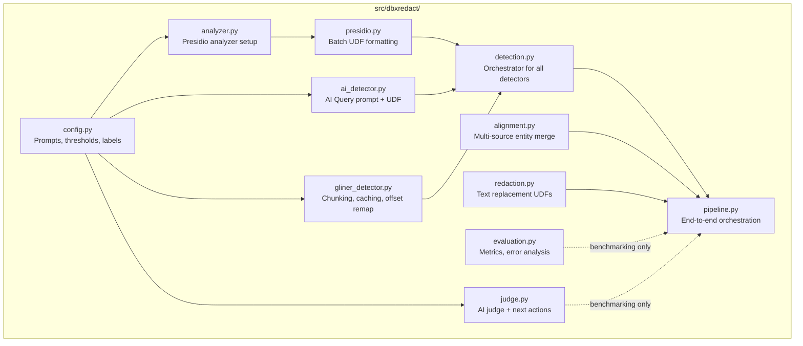

# dbxredact

PII/PHI detection and redaction solution accelerator for Databricks.

> **Disclaimer**: This is a Databricks Solution Accelerator -- a starting point to accelerate your project. dbxredact is high quality and fully functioning end-to-end, but you should evaluate, test, and modify this code for your specific use case. Detection and redaction results will vary depending on your data and configuration. 

## Overview

dbxredact provides tools for detecting, evaluating, and redacting Protected Health Information (PHI) and Personally Identifiable Information (PII) in text data on Databricks.

### Features

- **Multiple Detection Methods**: Presidio (rule-based), AI Query (LLM-based), and GLiNER (NER-based)
- **Multi-language Support**: AI Query and rule-based approaches support Spanish language
- **Entity Alignment**: Combine results from multiple detection methods with configurable modes (union/consensus)
- **Flexible Redaction**: Generic (`[REDACTED]`) or typed (`[PERSON]`, `[EMAIL]`) strategies
- **Benchmarking Pipeline**: End-to-end evaluation with AI judge, audit trail, and automated recommendations

## Architecture

### Production Redaction Pipeline



### Benchmarking & Development Feedback Loop


### Pipeline Module Structure



## Prerequisites

| Tool | Minimum Version | Purpose |
|------|----------------|---------|
| [Databricks CLI](https://docs.databricks.com/dev-tools/cli/install.html) | >= 0.283.0 | Bundle deployment and job management |
| [Poetry](https://python-poetry.org/docs/#installation) | >= 1.5 | Python dependency management and wheel build |
| [Node.js / npm](https://nodejs.org/) | >= 18 | Frontend build for the management app |
| Python | >= 3.10 | Core library and notebooks |

You also need:
- A **Databricks workspace** with Unity Catalog enabled
- A **SQL Warehouse** -- set the ID in `variables.yml` (`sql_warehouse_id`) for the app and deploy grants
- **Unity Catalog Volumes** for the target schema (created automatically by `deploy.sh` for `wheels`; you may need to create `cluster_logs` and `checkpoints` manually for benchmarking)

## Quickstart

### Option 1: CLI Deployment

1. **Configure environment**:
   ```bash
   cp example.env dev.env
   ```
   Edit `dev.env`:
   ```
   DATABRICKS_HOST=https://your-workspace.cloud.databricks.com
   CATALOG=your_catalog
   SCHEMA=redaction
   ```

2. **Deploy**:
   ```bash
   ./deploy.sh dev
   ```
   This builds the wheel, uploads it to a volume, and deploys the Databricks Asset Bundle.

3. **Run the redaction pipeline**:
   ```bash
   databricks bundle run redaction_pipeline -t dev \
     --params source_table=catalog.schema.source_table,text_column=text,output_table=catalog.schema.redacted_output
   ```

### Option 2: Git Folder (No CLI)

1. Clone to a Databricks Git Folder

2. Install dbxredact (choose one):
   ```python
   # From GitHub directly
   %pip install git+https://github.com/databricks-industry-solutions/dbxredact.git
   
   # Or download wheel from releases, upload to a volume, then:
   %pip install /Volumes/your_catalog/your_schema/wheels/dbxredact-<version>-py3-none-any.whl
   ```

3. Open `notebooks/4_redaction_pipeline.py`, configure widgets, and run

### Unity Catalog Volumes

The bundle and benchmark jobs require these volumes in your target schema. Create them before running jobs:

```sql
CREATE VOLUME IF NOT EXISTS your_catalog.your_schema.wheels;
CREATE VOLUME IF NOT EXISTS your_catalog.your_schema.cluster_logs;
CREATE VOLUME IF NOT EXISTS your_catalog.your_schema.checkpoints;
```

`deploy.sh` uploads the wheel to `wheels`. `cluster_logs` is used by the benchmark job for cluster log delivery. `checkpoints` is used by the streaming pipeline.

### Deploying to Production

The `prod` target in `databricks.yml.template` uses two variables that must be configured in `variables.yml`:

- `current_user`: The service principal or user email for `run_as` permissions (e.g. `deployer@company.com`)
- `current_working_directory`: The workspace path for artifact deployment (e.g. `/Workspace/Shared/dbxredact`)

Without these, the prod target will fail. Set them before running `./deploy.sh prod`.

### SQL Warehouse Configuration

The management app and the `deploy.sh` permission grants require a SQL Warehouse ID. Set it in `variables.yml`:

```yaml
sql_warehouse_id:
  default: "your_warehouse_id_here"
```

This is also needed in your `dev.env` / `prod.env` as `WAREHOUSE_ID` for the deploy script to execute SQL grants.

## Detection Methods

| Method | Description | Use Case |
|--------|-------------|----------|
| **Presidio** | Rule-based with spaCy NLP (default: `en_core_web_trf`, falls back to `_lg`/`_sm`) | Fast, deterministic, no API calls |
| **AI Query** | LLM-based via Databricks endpoints (default confidence: 0.8, reasoning effort: medium) | Context-aware, complex patterns |
| **GLiNER** | NER with `nvidia/gliner-PII` (PII/PHI-focused, 55+ entity types) | Transformer-based NER, GPU acceleration |

## Notebooks

| Notebook | Description |
|----------|-------------|
| `4_redaction_pipeline.py` | End-to-end detection and redaction (production use) |
| `1_benchmarking_detection.py` | Run detection with all methods |
| `2_benchmarking_evaluation.py` | Calculate metrics (precision, recall, F1) with strict/overlap matching |
| `3_benchmarking_redaction.py` | Apply redaction to detection results |
| `5_benchmarking_judge.py` | AI judge grades redacted text (PASS/PARTIAL/FAIL) |
| `6_benchmarking_audit.py` | Consolidate metrics and judge grades into audit table |
| `7_benchmarking_next_actions.py` | AI-generated improvement recommendations |

> **Synthetic benchmark data** is included in `data/` with ground-truth PII annotations (NAME, DATE, LOCATION, IDNUM, CONTACT):
>
> | File | Domain | Docs | Annotations |
> |------|--------|------|-------------|
> | `synthetic_benchmark_medical.csv` | Clinical (discharge summaries, lab reports, etc.) | 10 | ~180 |
> | `synthetic_benchmark_finance.csv` | Financial (wire transfers, loans, KYC, tax, etc.) | 10 | ~250 |
> | `synthetic_benchmark.csv` | Combined | 20 | ~430 |
>
> Upload a CSV to a Unity Catalog table and use it as both the source and ground truth for the benchmarking notebooks. To regenerate or customize: `python scripts/generate_synthetic_benchmark.py --domain medical|finance|all`.
>
> **Important:** After regenerating CSVs, you must re-upload the data to your Unity Catalog table for the updated annotations to take effect in benchmarking. Example:
> ```sql
> DROP TABLE IF EXISTS your_catalog.your_schema.synthetic_benchmark_medical;
> -- Then re-create from CSV upload or use the Databricks UI file upload
> ```
>
> For larger-scale evaluation, supply your own labeled dataset and update the widget defaults accordingly.

## API Reference

### Detection

```python
from dbxredact import run_detection_pipeline

result_df = run_detection_pipeline(
    spark=spark,
    source_df=source_df,
    doc_id_column="doc_id",
    text_column="text",
    use_presidio=True,
    use_ai_query=True,
    endpoint="databricks-gpt-oss-120b"
)
```

### Redaction

```python
from dbxredact import run_redaction_pipeline

result_df = run_redaction_pipeline(
    spark=spark,
    source_table="catalog.schema.medical_notes",
    text_column="note_text",
    output_table="catalog.schema.medical_notes_redacted",
    redaction_strategy="typed"  # or "generic"
)
```

### Simple Text Redaction

```python
from dbxredact import redact_text

text = "Patient John Smith (SSN: 123-45-6789) visited on 2024-01-15."
entities = [
    {"entity": "John Smith", "start": 8, "end": 18, "entity_type": "PERSON"},
    {"entity": "123-45-6789", "start": 25, "end": 36, "entity_type": "US_SSN"},
]

result = redact_text(text, entities, strategy="typed")
# "Patient [PERSON] (SSN: [US_SSN]) visited on 2024-01-15."
```

## Streaming (Incremental) Mode

The redaction pipeline supports incremental processing via Structured Streaming. Select **incremental** for the "Refresh Approach" widget in `4_redaction_pipeline.py`, or call `run_redaction_pipeline_streaming` directly.

### Key operational notes

- **Deduplication**: Output uses `foreachBatch` with `MERGE INTO` on `doc_id`, so re-processed or retried documents overwrite their earlier result rather than creating duplicates.
- **Checkpoint coupling**: The streaming checkpoint is tightly coupled to the Spark query plan. If you change which detectors are enabled, switch alignment mode, or modify detection logic, delete the checkpoint directory before restarting the stream.
- **`mergeSchema` is on**: Switching between `production` and `validation` output strategies will widen the output table automatically.
- **AI failure flagging**: When AI Query returns an error for a row, the output includes `_ai_detection_failed = True` and a warning is logged. These rows still flow through redaction (using other detectors if available) but should be reviewed or retried.
- **LLM non-determinism**: If a micro-batch is retried after a transient failure, AI Query may produce slightly different results for the same document.
- **`max_files_per_trigger`**: Controls how many files each micro-batch ingests (default 10). Set to 0 / None for unlimited. Useful for throttling first-run backfill on large tables.
- **Checkpoint path**: Should be a Unity Catalog Volume path (`/Volumes/catalog/schema/volume_name/...`). Non-Volume paths (DBFS, local) may not persist across cluster restarts; a warning is emitted if detected.

## Pipeline Details

### Output Columns

The pipeline reads only `doc_id` and the specified `text_column` from the source table. Other source columns are **not** carried to the output.

- **Production mode** (default): Output contains `doc_id` + `{text_column}_redacted`.
- **Validation mode**: Output includes all intermediate columns (raw detector results, aligned entities, redacted text) for debugging.

To join redacted output back to your original table, use `doc_id` as the key:

```sql
SELECT o.*, r.text_redacted
FROM catalog.schema.original o
JOIN catalog.schema.redacted r ON o.doc_id = r.doc_id
```

### Multiple Column Redaction

Currently, each pipeline run processes a single text column. Multi-column support is on the roadmap. For now, run the pipeline once per column and join outputs downstream on `doc_id`:

```python
for col in ["notes", "address", "comments"]:
    run_redaction_pipeline(spark, source_table=..., text_column=col,
                           output_table=f"..._{col}_redacted", ...)
```

### Document Length

dbxredact does not impose an explicit document length limit. Practical limits depend on the detection method:

- **GLiNER**: Handles long texts internally via word-boundary chunking with automatic offset correction (`_chunk_and_predict`). No user-side chunking needed.
- **AI Query**: Subject to the LLM endpoint's context window / token limit. Documents exceeding the limit will be truncated by the endpoint.
- **Presidio**: Processes text in-memory via spaCy. No hard cap, but very large documents may be slow.

### Allow / Deny Lists

Allow and deny lists are applied as post-processing filters after detection and alignment, not as Presidio custom recognizers. This means they work uniformly across all three detection methods. See `src/dbxredact/entity_filter.py` for the `EntityFilter` API and `load_filter_from_table` to load lists from Unity Catalog tables.

## Project Structure

```
dbxredact/
  databricks.yml.template  # DAB config template
  deploy.sh                # Build and deploy script
  pyproject.toml           # Poetry dependencies
  src/dbxredact/           # Core library
  notebooks/               # Databricks notebooks
  tests/                   # Unit and integration tests
```

## Testing

```bash
pytest tests/ -v
```

## Libraries

### Core Dependencies

| Library | Version | License | Description | PyPI |
|---------|---------|---------|-------------|------|
| presidio-analyzer | 2.2.358 | MIT | Microsoft Presidio PII detection engine | [PyPI](https://pypi.org/project/presidio-analyzer/) |
| presidio-anonymizer | 2.2.358 | MIT | Microsoft Presidio anonymization engine | [PyPI](https://pypi.org/project/presidio-anonymizer/) |
| spacy | 3.8.7 | MIT | Industrial-strength NLP library | [PyPI](https://pypi.org/project/spacy/) |
| gliner | >=0.1.0 | Apache 2.0 | Generalist NER using bidirectional transformers | [PyPI](https://pypi.org/project/gliner/) |
| rapidfuzz | >=3.0.0 | MIT | Fast fuzzy string matching | [PyPI](https://pypi.org/project/rapidfuzz/) |
| pydantic | >=2.0.0 | MIT | Data validation using Python type hints | [PyPI](https://pypi.org/project/pydantic/) |
| pyyaml | >=6.0.1 | MIT | YAML parser and emitter | [PyPI](https://pypi.org/project/PyYAML/) |
| databricks-sdk | >=0.30.0 | Apache 2.0 | Databricks SDK for Python | [PyPI](https://pypi.org/project/databricks-sdk/) |

### GLiNER Model

| Model | License | Description | HuggingFace |
|-------|---------|-------------|-------------|
| nvidia/gliner-PII | NVIDIA Open Model License | PII/PHI-focused NER model with 55+ entity types | [HuggingFace](https://huggingface.co/nvidia/gliner-PII) |

This solution accelerator uses the `nvidia/gliner-PII` model in accordance with the [NVIDIA Open Model License](https://developer.download.nvidia.com/licenses/nvidia-open-model-license-agreement-june-2024.pdf). The NVIDIA Open Model License permits commercial use and is compatible with the [DB License](LICENSE.md) under which this accelerator is released. However, **use of the model itself is governed by NVIDIA's license terms, not the DB License**. Customers are responsible for reviewing and complying with the NVIDIA Open Model License independently before deploying in production.

### spaCy Models (for Presidio)

The default is `en_core_web_trf` (RoBERTa transformer, NER F1 ~90.2%). The code auto-falls back to `_lg` or `_sm` if `_trf` is not installed. Install the best model available for your cluster:

| Model | NER F1 | Size | GPU | License | Install |
|-------|--------|------|-----|---------|---------|
| en_core_web_trf (recommended) | 90.2% | 438 MB | Recommended | MIT | [spaCy Models](https://spacy.io/models/en#en_core_web_trf) |
| en_core_web_lg | 85.4% | 560 MB | No | MIT | [spaCy Models](https://spacy.io/models/en#en_core_web_lg) |
| en_core_web_sm | 84.6% | 12 MB | No | MIT | [spaCy Models](https://spacy.io/models/en#en_core_web_sm) |

### Runtime Dependencies (provided by Databricks)

| Library | License | Description |
|---------|---------|-------------|
| pandas | BSD-3-Clause | Data manipulation library |
| pyspark | Apache 2.0 | Apache Spark Python API |
| pyarrow | Apache 2.0 | Apache Arrow Python bindings |

**All dependencies use permissive open-source licenses** (MIT, Apache 2.0, BSD-3-Clause). No copyleft (GPL) dependencies.

## Compliance and Responsibility

This is a **solution accelerator** -- it provides tooling to assist with PII/PHI detection and redaction, but **all compliance obligations remain with the user**. This includes but is not limited to:

- **HIPAA**: You are responsible for ensuring your deployment meets HIPAA requirements (encryption, access controls, audit logging, BAAs, etc.)
- **GDPR, CCPA, and other privacy regulations**: Evaluate whether your use of this tool satisfies applicable data protection laws
- **Validation**: You must verify that redaction results are complete and accurate for your specific data and use case
- **Data Encryption**: Enable encryption at rest and in transit in your Databricks workspace
- **Access Controls**: Configure appropriate table/catalog permissions in Unity Catalog
- **Audit Logging**: Enable workspace audit logs for compliance tracking

Databricks makes no guarantees that use of this tool alone is sufficient for regulatory compliance.

## License

[DB License](LICENSE.md)
