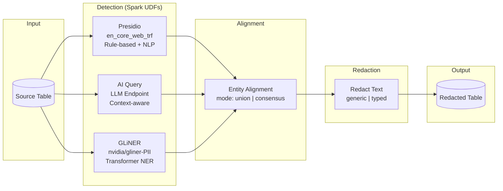
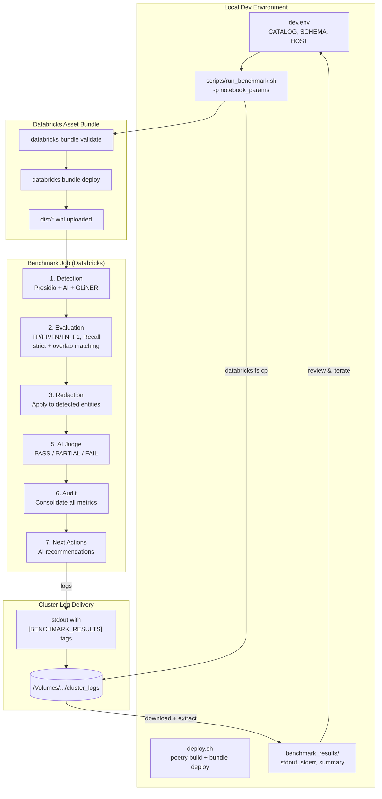
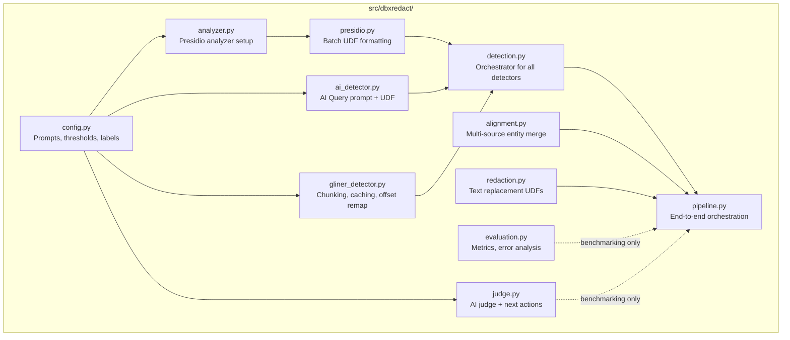

# dbxredact

PII/PHI detection and redaction solution accelerator for Databricks.

> **Disclaimer**: This is a Databricks Solution Accelerator -- a starting point to accelerate your project. dbxredact is high quality and fully functioning end-to-end, but you should evaluate, test, and modify this code for your specific use case. Detection and redaction results will vary depending on your data and configuration. 

## Overview

dbxredact provides tools for detecting, evaluating, and redacting Protected Health Information (PHI) and Personally Identifiable Information (PII) in text data on Databricks.

### Features

- **Multiple Detection Methods**: Presidio (rule-based), AI Query (LLM-based), and GLiNER (NER-based)
- **Multi-language Support**: AI Query and rule-based approaches support Spanish language
- **Entity Alignment**: Combine results from multiple detection methods with configurable modes (union/consensus)
- **Flexible Redaction**: Generic (`[REDACTED]`) or typed (`[PERSON]`, `[EMAIL]`) strategies
- **Benchmarking Pipeline**: End-to-end evaluation with AI judge, audit trail, and automated recommendations

## Architecture

### Production Redaction Pipeline



### Benchmarking & Development Feedback Loop



### Pipeline Module Structure



## Quickstart

### Option 1: CLI Deployment

1. **Configure environment**:
   ```bash
   cp example.env dev.env
   ```
   Edit `dev.env`:
   ```
   DATABRICKS_HOST=https://your-workspace.cloud.databricks.com
   CATALOG=your_catalog
   SCHEMA=redaction
   ```

2. **Deploy**:
   ```bash
   ./deploy.sh dev
   ```
   This builds the wheel, uploads it to a volume, and deploys the Databricks Asset Bundle.

3. **Run the redaction pipeline**:
   ```bash
   databricks bundle run redaction_pipeline -t dev \
     --notebook-params source_table=catalog.schema.source_table,text_column=text,output_table=catalog.schema.redacted_output
   ```

### Option 2: Git Folder (No CLI)

1. Clone to a Databricks Git Folder

2. Install dbxredact (choose one):
   ```python
   # From GitHub directly
   %pip install git+https://github.com/databricks-industry-solutions/dbxredact.git
   
   # Or download wheel from releases, upload to a volume, then:
   %pip install /Volumes/your_catalog/your_schema/wheels/dbxredact-<version>-py3-none-any.whl
   ```

3. Open `notebooks/4_redaction_pipeline.py`, configure widgets, and run

## Detection Methods

| Method | Description | Use Case |
|--------|-------------|----------|
| **Presidio** | Rule-based with spaCy NLP (default: `en_core_web_trf`, falls back to `_lg`/`_sm`) | Fast, deterministic, no API calls |
| **AI Query** | LLM-based via Databricks endpoints (default confidence: 0.8, reasoning effort: medium) | Context-aware, complex patterns |
| **GLiNER** | NER with `nvidia/gliner-PII` (PII/PHI-focused, 55+ entity types) | Transformer-based NER, GPU acceleration |

## Notebooks

| Notebook | Description |
|----------|-------------|
| `4_redaction_pipeline.py` | End-to-end detection and redaction (production use) |
| `1_benchmarking_detection.py` | Run detection with all methods |
| `2_benchmarking_evaluation.py` | Calculate metrics (precision, recall, F1) with strict/overlap matching |
| `3_benchmarking_redaction.py` | Apply redaction to detection results |
| `5_benchmarking_judge.py` | AI judge grades redacted text (PASS/PARTIAL/FAIL) |
| `6_benchmarking_audit.py` | Consolidate metrics and judge grades into audit table |
| `7_benchmarking_next_actions.py` | AI-generated improvement recommendations |

> **Note**: Notebooks 1-3 and 5-7 are benchmarking tools that require external evaluation data (e.g. the JSL benchmark dataset). This data is not included in the repository because it is not synthetic. To use these notebooks, supply your own labeled evaluation dataset and update the widget defaults accordingly.

## API Reference

### Detection

```python
from dbxredact import run_detection_pipeline

result_df = run_detection_pipeline(
    spark=spark,
    source_df=source_df,
    doc_id_column="doc_id",
    text_column="text",
    use_presidio=True,
    use_ai_query=True,
    endpoint="databricks-gpt-oss-120b"
)
```

### Redaction

```python
from dbxredact import run_redaction_pipeline

result_df = run_redaction_pipeline(
    spark=spark,
    source_table="catalog.schema.medical_notes",
    text_column="note_text",
    output_table="catalog.schema.medical_notes_redacted",
    redaction_strategy="typed"  # or "generic"
)
```

### Simple Text Redaction

```python
from dbxredact import redact_text

text = "Patient John Smith (SSN: 123-45-6789) visited on 2024-01-15."
entities = [
    {"entity": "John Smith", "start": 8, "end": 18, "entity_type": "PERSON"},
    {"entity": "123-45-6789", "start": 25, "end": 36, "entity_type": "US_SSN"},
]

result = redact_text(text, entities, strategy="typed")
# "Patient [PERSON] (SSN: [US_SSN]) visited on 2024-01-15."
```

## Project Structure

```
dbxredact/
  databricks.yml.template  # DAB config template
  deploy.sh                # Build and deploy script
  pyproject.toml           # Poetry dependencies
  src/dbxredact/           # Core library
  notebooks/               # Databricks notebooks
  tests/                   # Unit and integration tests
```

## Testing

```bash
pytest tests/ -v
```

## Libraries

### Core Dependencies

| Library | Version | License | Description | PyPI |
|---------|---------|---------|-------------|------|
| presidio-analyzer | 2.2.358 | MIT | Microsoft Presidio PII detection engine | [PyPI](https://pypi.org/project/presidio-analyzer/) |
| presidio-anonymizer | 2.2.358 | MIT | Microsoft Presidio anonymization engine | [PyPI](https://pypi.org/project/presidio-anonymizer/) |
| spacy | 3.8.7 | MIT | Industrial-strength NLP library | [PyPI](https://pypi.org/project/spacy/) |
| gliner | >=0.1.0 | Apache 2.0 | Generalist NER using bidirectional transformers | [PyPI](https://pypi.org/project/gliner/) |

### GLiNER Models

| Model | License | Description | HuggingFace |
|-------|---------|-------------|-------------|
| nvidia/gliner-PII | NVIDIA Open Model License | PII/PHI-focused NER model with 55+ entity types | [HuggingFace](https://huggingface.co/nvidia/gliner-PII) |

> **Note:** The `nvidia/gliner-PII` model is released under the [NVIDIA Open Model License](https://developer.download.nvidia.com/licenses/nvidia-open-model-license-agreement-june-2024.pdf), which permits commercial use but is not Apache 2.0. Users should review the license terms before deploying in production.
| rapidfuzz | >=3.0.0 | MIT | Fast fuzzy string matching | [PyPI](https://pypi.org/project/rapidfuzz/) |
| pydantic | >=2.0.0 | MIT | Data validation using Python type hints | [PyPI](https://pypi.org/project/pydantic/) |
| pyyaml | >=6.0.1 | MIT | YAML parser and emitter | [PyPI](https://pypi.org/project/PyYAML/) |
| databricks-sdk | >=0.30.0 | Apache 2.0 | Databricks SDK for Python | [PyPI](https://pypi.org/project/databricks-sdk/) |

### spaCy Models (for Presidio)

The default is `en_core_web_trf` (RoBERTa transformer, NER F1 ~90.2%). The code auto-falls back to `_lg` or `_sm` if `_trf` is not installed. Install the best model available for your cluster:

| Model | NER F1 | Size | GPU | License | Install |
|-------|--------|------|-----|---------|---------|
| en_core_web_trf (recommended) | 90.2% | 438 MB | Recommended | MIT | [spaCy Models](https://spacy.io/models/en#en_core_web_trf) |
| en_core_web_lg | 85.4% | 560 MB | No | MIT | [spaCy Models](https://spacy.io/models/en#en_core_web_lg) |
| en_core_web_sm | 84.6% | 12 MB | No | MIT | [spaCy Models](https://spacy.io/models/en#en_core_web_sm) |

### Runtime Dependencies (provided by Databricks)

| Library | License | Description |
|---------|---------|-------------|
| pandas | BSD-3-Clause | Data manipulation library |
| pyspark | Apache 2.0 | Apache Spark Python API |
| pyarrow | Apache 2.0 | Apache Arrow Python bindings |

**All dependencies use permissive open-source licenses** (MIT, Apache 2.0, BSD-3-Clause). No copyleft (GPL) dependencies.

## Compliance and Responsibility

This is a **solution accelerator** -- it provides tooling to assist with PII/PHI detection and redaction, but **all compliance obligations remain with the user**. This includes but is not limited to:

- **HIPAA**: You are responsible for ensuring your deployment meets HIPAA requirements (encryption, access controls, audit logging, BAAs, etc.)
- **GDPR, CCPA, and other privacy regulations**: Evaluate whether your use of this tool satisfies applicable data protection laws
- **Validation**: You must verify that redaction results are complete and accurate for your specific data and use case
- **Data Encryption**: Enable encryption at rest and in transit in your Databricks workspace
- **Access Controls**: Configure appropriate table/catalog permissions in Unity Catalog
- **Audit Logging**: Enable workspace audit logs for compliance tracking

Databricks makes no guarantees that use of this tool alone is sufficient for regulatory compliance.

## License

[DB License](LICENSE.md)
