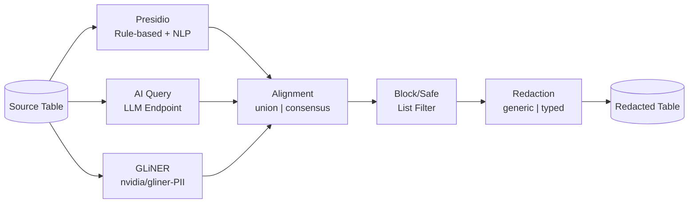
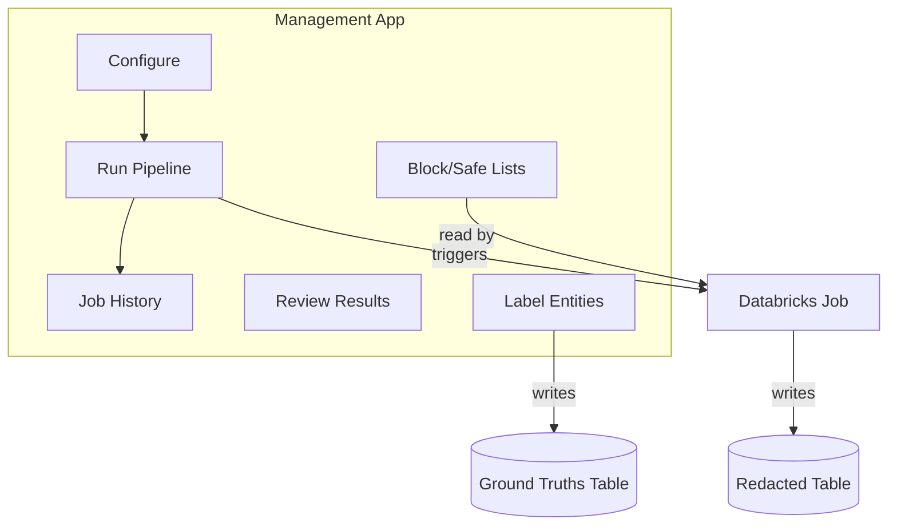
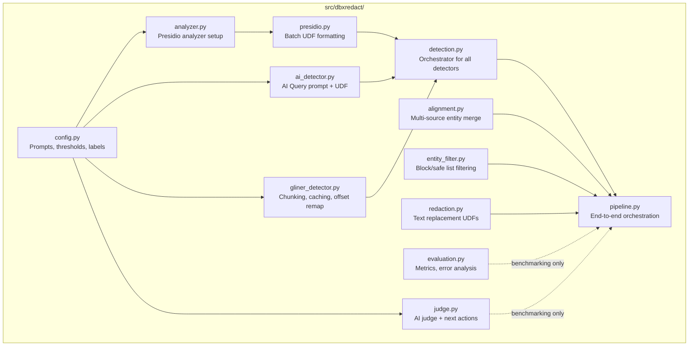

# dbxredact

PII/PHI detection and redaction for Databricks, with a management web app.

> **Disclaimer**: This is a Databricks Solution Accelerator -- a starting point for your project. Evaluate, test, and customize for your use case. Detection accuracy depends on your data and configuration.

## What It Does

dbxredact detects and redacts Protected Health Information (PHI) and Personally Identifiable Information (PII) in text data stored in Unity Catalog. It ships as:

1. **A Python library** (`src/dbxredact/`) with Spark UDFs for detection, alignment, redaction, and evaluation
2. **Databricks notebooks** for running redaction and benchmarking pipelines
3. **A web management app** (FastAPI + React, deployed as a Databricks App) for configuration, pipeline execution, review, and labeling

### Key Capabilities

- **Three detection methods**: Presidio (rule-based NLP), AI Query (LLM endpoints), GLiNER (`nvidia/gliner-PII` transformer NER)
- **Multi-language support**: AI Query and rule-based approaches support Spanish language
- **Entity alignment**: Union (recall-focused) or consensus (precision-focused) across detectors
- **Typed or generic redaction**: `[PERSON]` / `[EMAIL]` or `[REDACTED]`
- **Block / safe lists**: Deny lists (always flag) and allow lists (suppress false positives), stored in UC tables, applied uniformly across all detectors
- **Benchmarking**: Automated evaluation (precision, recall, F1), AI judge grading, and improvement recommendations
- **Streaming**: Incremental processing via Structured Streaming with checkpoint-based deduplication
- **GPU acceleration**: GPU cluster profiles for GLiNER inference
- **Cost estimation**: Pre-run token and compute cost estimates in the management app

## Prerequisites

- [Databricks CLI](https://docs.databricks.com/dev-tools/cli/install.html) >= 0.283.0
- [Poetry](https://python-poetry.org/docs/#installation) >= 2.0
- [Node.js / npm](https://nodejs.org/) >= 18 (for the web app frontend build)
- Python >= 3.10
- A Databricks workspace with Unity Catalog enabled
- A SQL Warehouse -- set the ID in `variables.yml` (`sql_warehouse_id`) and in your `dev.env` / `prod.env` as `WAREHOUSE_ID`

## Quickstart

### 1. Configure Environment

```bash
cp example.env dev.env
```

Edit `dev.env`:
```
DATABRICKS_HOST=https://your-workspace.cloud.databricks.com
CATALOG=your_catalog
SCHEMA=redaction
WAREHOUSE_ID=your_warehouse_id

# Optional: set to "false" to deploy jobs only (no app)
# DEPLOY_APP=false
```

`WAREHOUSE_ID` is required when deploying the app (for the app's SQL warehouse resource and deploy-time permission grants). If `DEPLOY_APP=false`, it can be omitted.

### 2. Deploy

```bash
./deploy.sh dev
```

This builds the Python wheel, generates `databricks.yml` from the template, and deploys the Databricks Asset Bundle (jobs, app, and artifacts). Use `DEPLOY_APP=false` in your env file to deploy jobs without the management app.

### 3. Run a Pipeline

**From the app**: Open the deployed Databricks App, go to "Run Pipeline", select your source table, choose a cluster profile, and click "Launch".

**From CLI**:
```bash
databricks bundle run redaction_pipeline_cpu_small -t dev \
  --params source_table=catalog.schema.source,text_column=text,output_table=catalog.schema.redacted
```

### 4. Alternative: Git Folder (No CLI)

Clone to a Databricks Git Folder, install the library, and run notebooks directly:
```python
# From GitHub directly
%pip install git+https://github.com/databricks-industry-solutions/dbxredact.git

# Or download wheel from releases, upload to a volume, then:
%pip install /Volumes/your_catalog/your_schema/wheels/dbxredact-<version>-py3-none-any.whl
```

Open `notebooks/4_redaction_pipeline.py`, configure widgets, and run.

### Unity Catalog Volumes

Create these volumes before deploying:
```sql
CREATE VOLUME IF NOT EXISTS your_catalog.your_schema.wheels;
CREATE VOLUME IF NOT EXISTS your_catalog.your_schema.cluster_logs;
CREATE VOLUME IF NOT EXISTS your_catalog.your_schema.checkpoints;
```

`deploy.sh` uploads the wheel to `wheels`. `cluster_logs` is used by the benchmark job for cluster log delivery. `checkpoints` is used by the streaming pipeline.

> **Note:** The wheel volume only needs to exist in the deployment schema (the `SCHEMA` in your env file). The redaction pipeline itself can read from and write to any fully qualified table in any schema -- the wheel does not need to be present in every source or output schema.

## Detection Methods

| Method | Model | When to Use |
|--------|-------|-------------|
| **Presidio** | spaCy `en_core_web_trf` (auto-falls back to `_lg`/`_sm`) | Fast, deterministic, no API calls |
| **AI Query** | Databricks LLM endpoints (default: `databricks-gpt-oss-120b`) | Context-aware detection of complex patterns |
| **GLiNER** | `nvidia/gliner-PII` (55+ entity types) | Transformer NER, GPU-accelerated, no API calls |

Detection methods can be used individually or in ensemble. Ensemble results are merged via configurable alignment (union or consensus).

### Detection Profiles

| Profile | Detectors | GLiNER Chunk | Presidio | Best For |
|---------|-----------|-------------|----------|----------|
| **Fast** (default) | AI Query (low) + GLiNER + Presidio (pattern-only) | 256 words | Pattern-only (no spaCy) | Routine redaction, large-scale batch |
| **Deep** | All three | 256 words | spaCy trf | Compliance-critical, maximum recall |
| **Custom** | Manual | Manual | Manual | Experimenting with specific configs |

The **fast** profile achieves F1~0.89 (overlap) across benchmark datasets by combining AI Query with GLiNER and Presidio in pattern-only mode (deterministic regex for SSN, phone, MRN, dates -- no spaCy required).

### Presidio Pattern-Only Mode

When Presidio is enabled, it normally loads spaCy NER models (400+ MB). If you want deterministic pattern-based detection as a lightweight backup (SSN, phone, MRN, dates, reference IDs) without the spaCy dependency, pass `presidio_pattern_only=True`:

```python
result_df = run_detection_pipeline(
    spark=spark, source_df=df, doc_id_column="doc_id", text_column="text",
    use_presidio=True, use_ai_query=True, use_gliner=True,
    presidio_pattern_only=True,  # regex-only, no spaCy
)
```

Pattern-only mode uses Presidio's built-in regex recognizers (SSN, phone, email, credit card, IP) plus custom recognizers for MRN, reference IDs, age/gender, and DD/MM date formats. NER-based recognizers (PERSON, LOCATION) are skipped.

### Benchmark Interpretation

Ground-truth annotations may not be perfect -- some edge cases (3-letter hospital abbreviations, bare number sequences, standalone day names) represent a ceiling that no general model will fully reach. When evaluating benchmark results:

- Focus on **aligned recall** (the aligned output is what drives redaction) and **precision** (false positives erode user trust).
- Use **block lists** to force-flag known entities that detectors miss, and **safe lists** to suppress recurring false positives.
- Re-run benchmarks after config changes to measure the actual impact.

## Cluster Profiles

Six pre-configured job variants ship with the bundle:

| Profile | Workers | Instance (default) | Use Case |
|---------|---------|----------|----------|
| CPU Small | 2 | i3.xlarge | Development, small datasets |
| CPU Medium | 5 | i3.xlarge | Medium workloads |
| CPU Large | 10 | i3.xlarge | Production scale |
| GPU Small | 2 | g5.xlarge | GLiNER, small datasets |
| GPU Medium | 5 | g5.xlarge | GLiNER, medium datasets |
| GPU Large | 10 | g5.xlarge | GLiNER at scale |

GPU profiles use Databricks Runtime `17.3.x-gpu-ml-scala2.13`.

### Cloud-Specific Node Types

The default instance types are AWS-specific. Azure workspaces must override `cpu_node_type` and `gpu_node_type` in `variables.yml` or their target config:

| Type | AWS (default) | Azure equivalent |
|------|---------------|------------------|
| CPU | i3.xlarge | Standard_DS3_v2 |
| GPU | g5.xlarge | Standard_NC4as_T4_v3 |

If you see `Node type X is not supported` during deployment, set the correct node type for your cloud in `variables.yml`:
```yaml
cpu_node_type:
  default: "Standard_DS3_v2"
gpu_node_type:
  default: "Standard_NC4as_T4_v3"
```

## Management App

dbxredact includes a web application deployed as a [Databricks App](https://docs.databricks.com/en/dev-tools/databricks-apps/index.html). The app provides:

- **Configuration**: Create and manage detection configurations (enable/disable detectors, set thresholds, choose endpoints)
- **Block / Safe Lists**: Add terms to block lists (always flag) or safe lists (suppress false positives) via the UI
- **Run Pipeline**: Select a source table, choose a cluster profile (CPU/GPU, Small/Medium/Large), view cost estimates, and trigger redaction jobs
- **Job History**: Monitor pipeline runs with status tracking, cost estimates, and links to Databricks job runs
- **Review**: Side-by-side comparison of original and redacted text
- **Labeling**: Annotate entities by highlighting text to build ground-truth datasets for evaluation

The app is defined in `apps/dbxredact-app/` and deployed via the Databricks Asset Bundle (`resources/app.yml`).

## Architecture

### Detection Pipeline



### Management App



### Pipeline Module Structure



### Benchmarking & Development Feedback Loop


## Notebooks

| Notebook | Purpose |
|----------|---------|
| `4_redaction_pipeline.py` | Production redaction (full or incremental) |
| `0_load_benchmark_data.py` | Upload benchmark CSVs to Unity Catalog |
| `1_benchmarking_detection.py` | Run all detection methods |
| `2_benchmarking_evaluation.py` | Precision, recall, F1 (strict + overlap matching) |
| `3_benchmarking_redaction.py` | Apply redaction to detection results |
| `5_benchmarking_judge.py` | AI judge grades redacted output |
| `6_benchmarking_audit.py` | Consolidate metrics into audit table |
| `7_benchmarking_next_actions.py` | AI-generated improvement recommendations |
| `9_gliner_fine_tuning.py` | Fine-tune GLiNER on custom labeled data |

> **Synthetic benchmark data** is included in `data/` with ground-truth PII annotations (NAME, DATE, LOCATION, IDNUM, CONTACT):
>
> | File | Domain | Docs | Annotations |
> |------|--------|------|-------------|
> | `synthetic_benchmark_medical.csv` | Clinical (discharge summaries, lab reports, etc.) | 10 | ~180 |
> | `synthetic_benchmark_finance.csv` | Financial (wire transfers, loans, KYC, tax, etc.) | 10 | ~250 |
> | `synthetic_benchmark.csv` | Combined | 20 | ~430 |
>
> Upload a CSV to a Unity Catalog table and use it as both the source and ground truth for the benchmarking notebooks. To regenerate or customize: `python scripts/generate_synthetic_benchmark.py --domain medical|finance|all`.
>
> **Important:** After regenerating CSVs, you must re-upload the data to your Unity Catalog table for the updated annotations to take effect in benchmarking. Example:
> ```sql
> DROP TABLE IF EXISTS your_catalog.your_schema.synthetic_benchmark_medical;
> -- Then re-create from CSV upload or use the Databricks UI file upload
> ```
>
> For larger-scale evaluation, supply your own labeled dataset and update the widget defaults accordingly.

## API Reference

### Full Pipeline

```python
from dbxredact import run_redaction_pipeline

result_df = run_redaction_pipeline(
    spark=spark,
    source_table="catalog.schema.medical_notes",
    text_column="note_text",
    output_table="catalog.schema.medical_notes_redacted",
    use_presidio=True,
    use_ai_query=True,
    use_gliner=False,
    redaction_strategy="typed",
)
```

### Detection Only

```python
from dbxredact import run_detection_pipeline

result_df = run_detection_pipeline(
    spark=spark,
    source_df=source_df,
    doc_id_column="doc_id",
    text_column="text",
    use_presidio=True,
    use_ai_query=True,
    endpoint="databricks-gpt-oss-120b",
)
```

### Simple Text Redaction

```python
from dbxredact import redact_text

text = "Patient John Smith (SSN: 123-45-6789) visited on 2024-01-15."
entities = [
    {"entity": "John Smith", "start": 8, "end": 18, "entity_type": "PERSON"},
    {"entity": "123-45-6789", "start": 25, "end": 36, "entity_type": "US_SSN"},
]
result = redact_text(text, entities, strategy="typed")
# "Patient [PERSON] (SSN: [US_SSN]) visited on 2024-01-15."
```

## Block / Safe Lists

Block and safe lists are applied as post-processing filters after detection and alignment, not as Presidio custom recognizers. This means they work uniformly across all three detection methods. **Block lists** force specific terms to always be flagged as PII. **Safe lists** suppress false positives by removing matches. They are stored as Unity Catalog tables (`redact_block_list`, `redact_safe_list`) and can be managed through the app UI or SQL.

See `src/dbxredact/entity_filter.py` for the `EntityFilter` API and `load_filter_from_table` to load lists from Unity Catalog tables.

## Streaming (Incremental) Mode

The redaction pipeline supports incremental processing via Structured Streaming. Select **incremental** for the "Refresh Approach" widget in `4_redaction_pipeline.py`, or call `run_redaction_pipeline_streaming` directly.

### Key operational notes

- **Deduplication**: Output uses `foreachBatch` with `MERGE INTO` on `doc_id`, so re-processed or retried documents overwrite their earlier result rather than creating duplicates.
- **Checkpoint coupling**: The streaming checkpoint is tightly coupled to the Spark query plan. If you change which detectors are enabled, switch alignment mode, or modify detection logic, delete the checkpoint directory before restarting the stream.
- **`mergeSchema` is on**: Switching between `production` and `validation` output strategies will widen the output table automatically.
- **AI failure flagging**: When AI Query returns an error for a row, the output includes `_ai_detection_failed = True` and a warning is logged. These rows still flow through redaction (using other detectors if available) but should be reviewed or retried.
- **LLM non-determinism**: If a micro-batch is retried after a transient failure, AI Query may produce slightly different results for the same document.
- **`max_files_per_trigger`**: Controls how many files each micro-batch ingests (default 10). Set to 0 / None for unlimited. Useful for throttling first-run backfill on large tables.
- **Checkpoint path**: Should be a Unity Catalog Volume path (`/Volumes/catalog/schema/volume_name/...`). Non-Volume paths (DBFS, local) may not persist across cluster restarts; a warning is emitted if detected.

## Pipeline Details

### Output Columns

The pipeline reads only `doc_id` and the specified `text_column` from the source table. Other source columns are **not** carried to the output.

- **Production mode** (default): Output contains `doc_id` + `{text_column}_redacted`.
- **Validation mode**: Output includes all intermediate columns (raw detector results, aligned entities, redacted text) for debugging.

To join redacted output back to your original table, use `doc_id` as the key:

```sql
SELECT o.*, r.text_redacted
FROM catalog.schema.original o
JOIN catalog.schema.redacted r ON o.doc_id = r.doc_id
```

### Multiple Column Redaction

Currently, each pipeline run processes a single text column. Multi-column support is on the roadmap. For now, run the pipeline once per column and join outputs downstream on `doc_id`:

```python
for col in ["notes", "address", "comments"]:
    run_redaction_pipeline(spark, source_table=..., text_column=col,
                           output_table=f"..._{col}_redacted", ...)
```

### Document Length

No explicit limit. Practical limits depend on the detection method:

- **GLiNER**: Handles long texts internally via word-boundary chunking with automatic offset correction (`_chunk_and_predict`). No user-side chunking needed.
- **AI Query**: Subject to the LLM endpoint's context window / token limit. Documents exceeding the limit will be truncated by the endpoint.
- **Presidio**: Processes text in-memory via spaCy. No hard cap, but very large documents may be slow.

## Project Structure

```
dbxredact/
  databricks.yml.template    # DAB config template (deploy.sh generates databricks.yml)
  deploy.sh                  # Build, configure, and deploy script
  pyproject.toml             # Poetry dependencies and build config
  variables.yml              # Bundle variables (catalog, schema, etc.)
  example.env                # Template for dev.env / prod.env
  src/dbxredact/             # Core Python library
    config.py                #   Prompts, thresholds, entity labels
    detection.py             #   Orchestrator for all detectors
    gliner_detector.py       #   GLiNER batch UDF with worker-level model cache
    presidio.py              #   Presidio batch UDF
    ai_detector.py           #   AI Query prompt construction + UDF
    alignment.py             #   Multi-source entity merge (union/consensus)
    redaction.py             #   Text replacement UDFs
    entity_filter.py         #   Block/safe list filtering
    pipeline.py              #   End-to-end orchestration
    evaluation.py            #   Metrics (precision, recall, F1)
    judge.py                 #   AI judge + next actions
    cost.py                  #   Token cost estimation constants
  notebooks/                 # Databricks notebooks
    4_redaction_pipeline.py  #   Production redaction pipeline
    0_load_benchmark_data.py #   Upload benchmark CSVs to UC
    1-7_benchmarking_*.py    #   Benchmarking pipeline steps
    9_gliner_fine_tuning.py  #   GLiNER fine-tuning notebook
  apps/dbxredact-app/        # Management web app
    app.py                   #   FastAPI entry point + SPA serving
    api/                     #   Backend API routes and services
    src/                     #   React frontend source
    package.json             #   Node.js dependencies
  resources/                 # DAB resource definitions
    jobs.yml                 #   Job definitions (CPU/GPU x Small/Medium/Large)
    app.yml                  #   App resource definition
  scripts/                   # Utility scripts
  data/                      # Synthetic benchmark datasets
  tests/                     # Unit tests
```

## Testing

```bash
poetry install
pytest tests/ -v
```

## Compute Types
Use an ML cluster - not currently working on serverless. GLiNER models perform better on GPU, but other models do not.

## Libraries

### Core Dependencies

| Library | Version | License | Description | PyPI |
|---------|---------|---------|-------------|------|
| presidio-analyzer | 2.2.358 | MIT | Microsoft Presidio PII detection engine | [PyPI](https://pypi.org/project/presidio-analyzer/) |
| presidio-anonymizer | 2.2.358 | MIT | Microsoft Presidio anonymization engine | [PyPI](https://pypi.org/project/presidio-anonymizer/) |
| spacy | 3.8.7 | MIT | Industrial-strength NLP library | [PyPI](https://pypi.org/project/spacy/) |
| gliner | >=0.2.0 | Apache 2.0 | Generalist NER using bidirectional transformers | [PyPI](https://pypi.org/project/gliner/) |
| rapidfuzz | >=3.0.0 | MIT | Fast fuzzy string matching | [PyPI](https://pypi.org/project/rapidfuzz/) |
| pydantic | >=2.0.0 | MIT | Data validation using Python type hints | [PyPI](https://pypi.org/project/pydantic/) |
| pyyaml | >=6.0.1 | MIT | YAML parser and emitter | [PyPI](https://pypi.org/project/PyYAML/) |
| databricks-sdk | >=0.30.0 | Apache 2.0 | Databricks SDK for Python | [PyPI](https://pypi.org/project/databricks-sdk/) |

### GLiNER Model

| Model | License | Description | HuggingFace |
|-------|---------|-------------|-------------|
| nvidia/gliner-PII | NVIDIA Open Model License | PII/PHI-focused NER model with 55+ entity types | [HuggingFace](https://huggingface.co/nvidia/gliner-PII) |

This solution accelerator uses the `nvidia/gliner-PII` model in accordance with the [NVIDIA Open Model License](https://developer.download.nvidia.com/licenses/nvidia-open-model-license-agreement-june-2024.pdf). The NVIDIA Open Model License permits commercial use and is compatible with the [DB License](LICENSE.md) under which this accelerator is released. However, **use of the model itself is governed by NVIDIA's license terms, not the DB License**. Customers are responsible for reviewing and complying with the NVIDIA Open Model License independently before deploying in production.

### spaCy Models (for Presidio)

The default is `en_core_web_trf` (RoBERTa transformer, NER F1 ~90.2%). The code auto-falls back to `_lg` or `_sm` if `_trf` is not installed. Install the best model available for your cluster:

| Model | NER F1 | Size | GPU | License | Install |
|-------|--------|------|-----|---------|---------|
| en_core_web_trf (recommended) | 90.2% | 438 MB | Recommended | MIT | [spaCy Models](https://spacy.io/models/en#en_core_web_trf) |
| en_core_web_lg | 85.4% | 560 MB | No | MIT | [spaCy Models](https://spacy.io/models/en#en_core_web_lg) |
| en_core_web_sm | 84.6% | 12 MB | No | MIT | [spaCy Models](https://spacy.io/models/en#en_core_web_sm) |

### Runtime Dependencies (provided by Databricks)

| Library | License | Description |
|---------|---------|-------------|
| pandas | BSD-3-Clause | Data manipulation library |
| pyspark | Apache 2.0 | Apache Spark Python API |
| pyarrow | Apache 2.0 | Apache Arrow Python bindings |

**All dependencies use permissive open-source licenses** (MIT, Apache 2.0, BSD-3-Clause). No copyleft (GPL) dependencies.

## Deploying to Production

Set these variables in `variables.yml` before running `./deploy.sh prod`:

- `current_user`: Service principal or user email for `run_as` permissions (e.g. `deployer@company.com`)
- `current_working_directory`: Workspace path for artifact deployment (e.g. `/Workspace/Shared/dbxredact`)

The `prod` target enforces `run_as` permissions and requires explicit user configuration.

## Compliance and Responsibility

This is a **solution accelerator** -- it provides tooling to assist with PII/PHI detection and redaction, but **all compliance obligations remain with the user**. This includes but is not limited to:

- **HIPAA**: You are responsible for ensuring your deployment meets HIPAA requirements (encryption, access controls, audit logging, BAAs, etc.)
- **GDPR, CCPA, and other privacy regulations**: Evaluate whether your use of this tool satisfies applicable data protection laws
- **Validation**: You must verify that redaction results are complete and accurate for your specific data and use case
- **Data Encryption**: Enable encryption at rest and in transit in your Databricks workspace
- **Access Controls**: Configure appropriate table/catalog permissions in Unity Catalog
- **Audit Logging**: Enable workspace audit logs for compliance tracking

Databricks makes no guarantees that use of this tool alone is sufficient for regulatory compliance.

## License

[DB License](LICENSE.md)
